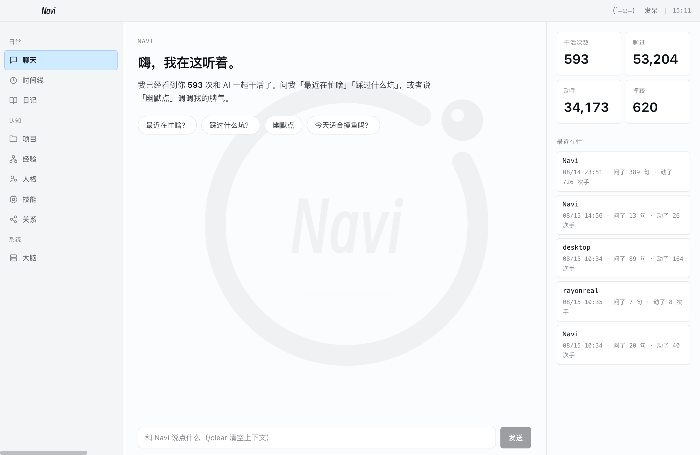
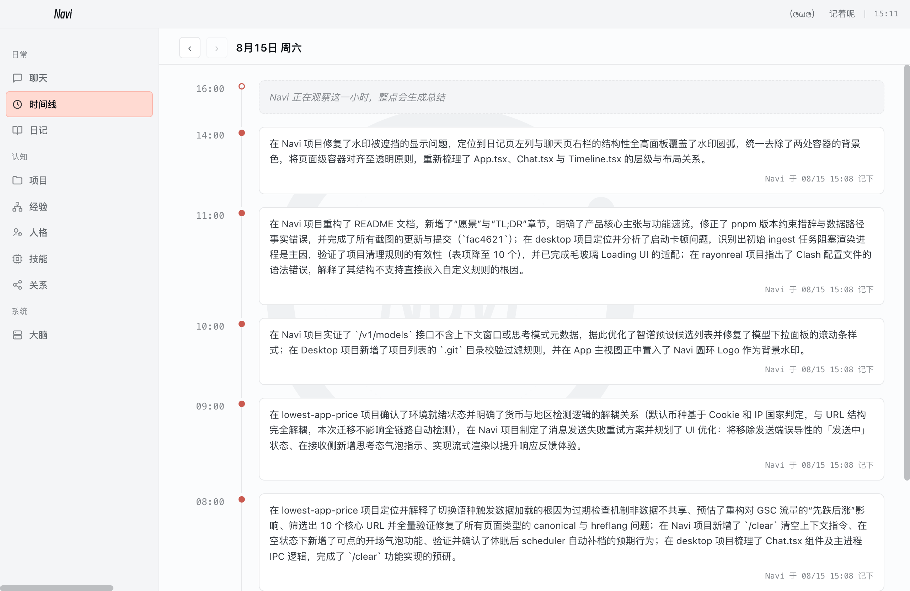
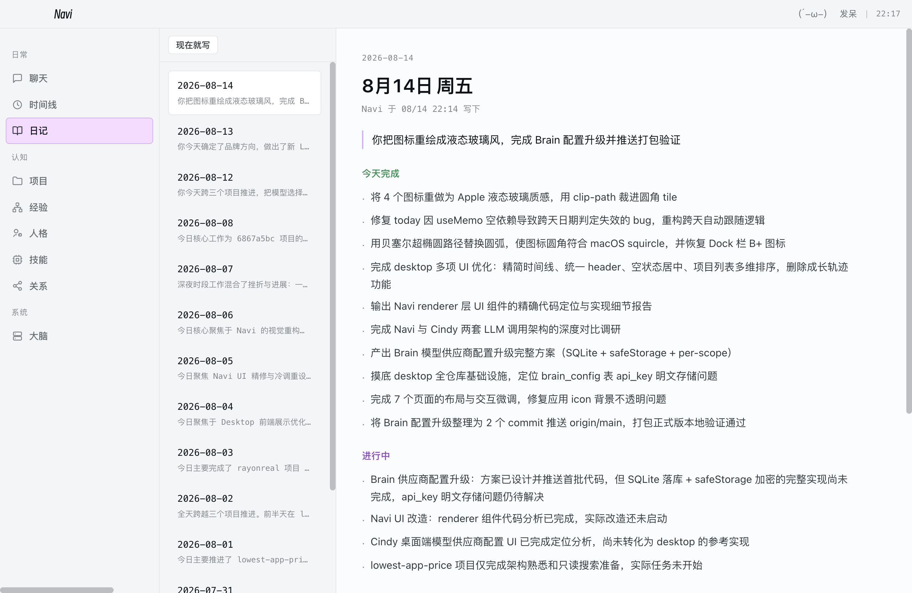
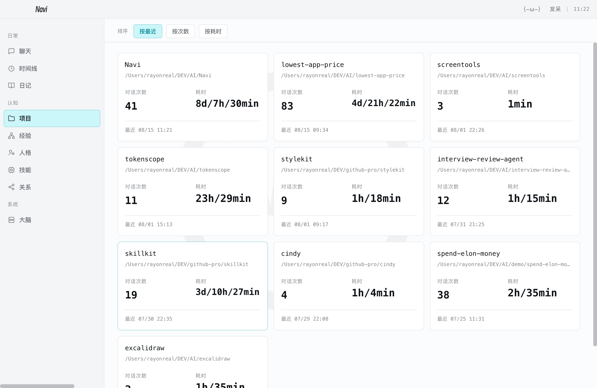
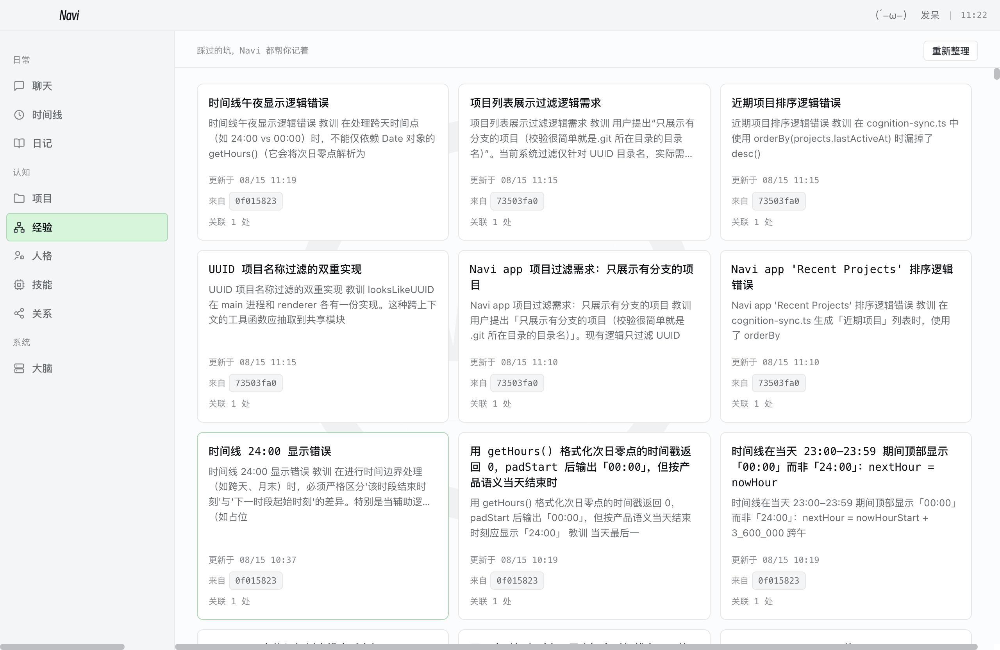
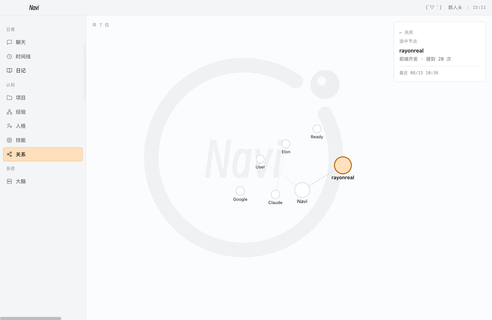
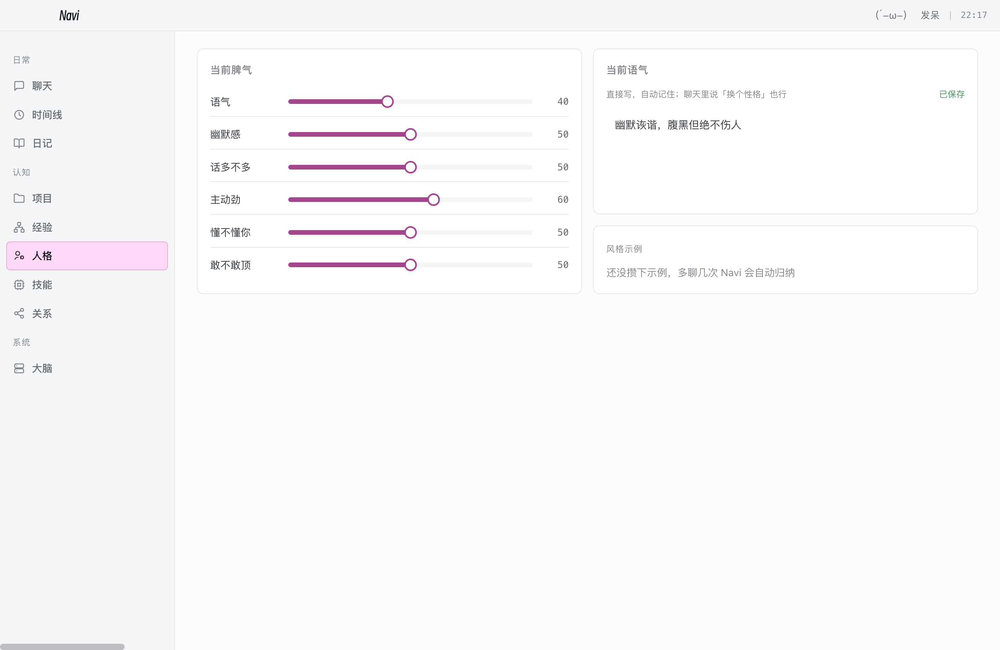
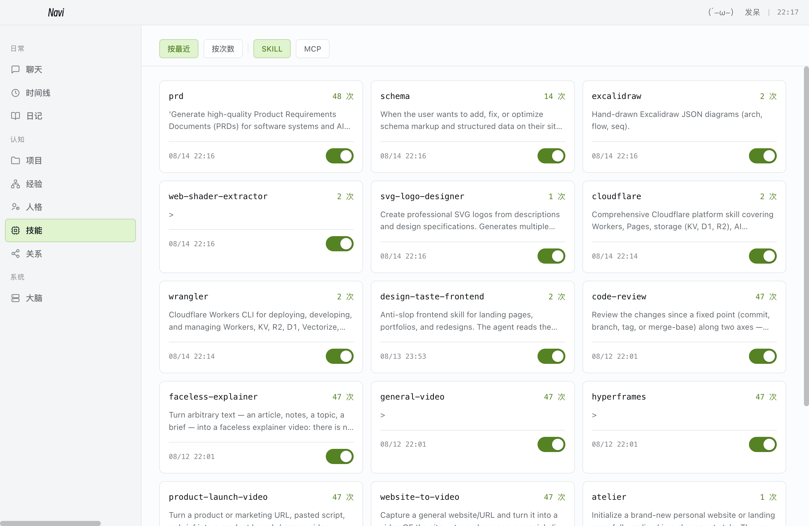
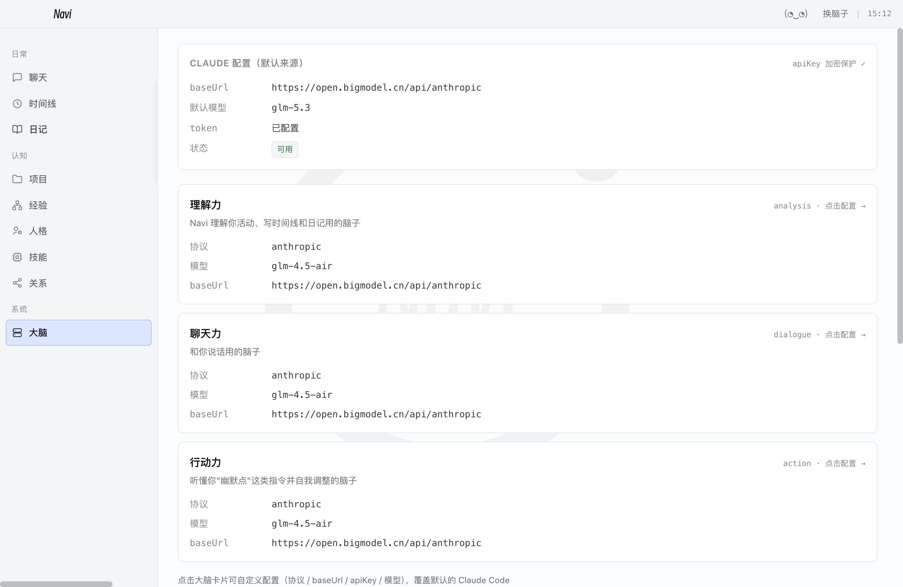
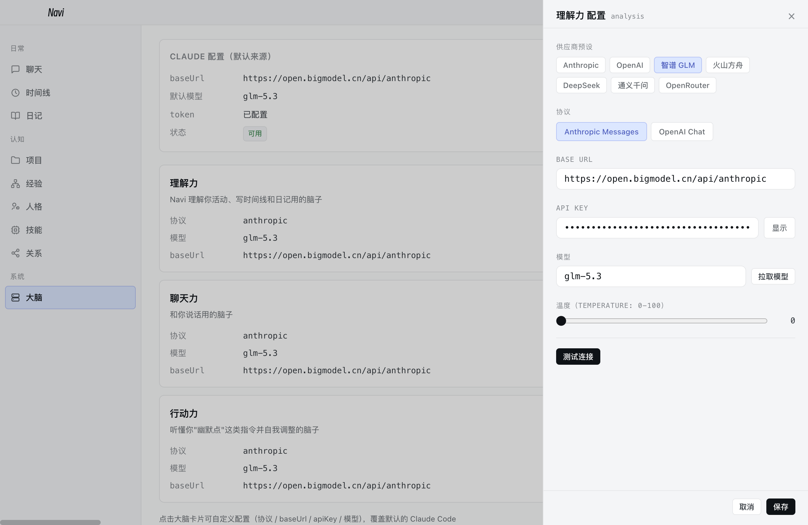

# Navi

[](LICENSE)
[](https://github.com/HduSy/navi/pulls)

> Your AI work companion that observes, remembers, and grows with you.

## 愿景

你和 AI 一起干了很多活，但这些经历默认散落在 jsonl 里，没有谁帮你记住。Navi 想补上这一块：

- **协作经历值得自动沉淀**——做成了什么、踩过什么坑、和谁打过交道，应当自己长成记忆，而不是每次从零开始
- **记忆只属于你**——本地优先，所有数据留在你自己的磁盘上，不上云、不外发
- **伙伴不是镜像，是陪伴**——Navi 有自己的脾气和成长轨迹，你对它的调教它都记得；而它对你的了解，最终通过认知同步回流给你在用的每一个 AI 工具

## TL;DR

Navi 是一个本地优先的桌面 AI 伙伴（Electron + React + SQLite）。它默默观察你和 Claude Code（及更多本地工具）的每一次协作，自己长出人格、技能、经验、项目认知和社交关系——能聊天、能自我调校、也能回看你自己一段时间的工作轨迹。

- **时间线**：每小时自动总结你「做成了什么」，采集中 → 分析中 → 结果三态可视，跨天自动回填近 7 天缺档
- **日记**：每晚 21 点把当天聚合成结构化日报（做了什么 / 进行中 / 关键决策 / 待办）
- **聊天**：流式逐字渲染 + 思考态指示；有脾气、有记忆，聊天里可直接调教人格，`/clear` 一键清空上下文
- **经验 / 项目 / 技能 / 人物关系**：全部从会话自动长出，沉淀为可编辑的 markdown wiki
- **三大脑**：分析 / 对话 / 行动三个 scope 各配各的模型，双协议（Anthropic / OpenAI 兼容），7 家供应商预设，限流自动退避重试
- **认知同步**：人格 / 项目 / 经验回流到各 AI 工具的全局上下文，分钟级增量
- **本地优先**：所有数据存在 `userData/navi.db` + `userData/wiki/`，零云端；配过 Claude Code 即零配置可用

## 界面一览

| 聊天 | 时间线 |
|---|---|
|  |  |

| 日记 | 项目 |
|---|---|
|  |  |

| 经验 | 关系 |
|---|---|
|  |  |

## 功能说明

### 💬 聊天 —— 有脾气、有记忆的对话


和 Navi 直接对话。回复由 dialogue brain（LLM + RAG）生成：注入人格维度、自由描述、命中的 wiki 记忆和当前状态，**SSE 流式逐字渲染**，等待期有思考态指示（弹跳点 → 逐字输出）。说「幽默点」「话少点」这类指令时，action brain 会先识别意图并自我调校人格——每次调整都进 `personality_history`，可回滚。`/clear` 一键清空聊天上下文（DB 历史与界面一起清），空状态提供可点的开场气泡。右侧面板统计你跟 AI 干活的次数、聊过的消息、动手次数和踩过的错误。

### 🕐 时间线 —— 每小时记下你做成了什么


Scheduler 每 5 分钟轮询，把每个已结束小时的你和 Claude Code 的对话交给 analysis brain 总结——聚焦「成果」而非「动作」，按项目组织。每个时段三态可视：当前小时「采集中」→ 小时结束后分析任务执行期间「分析中」→ 落盘展示结果（分析完成界面原地刷新）。时间语义严格区分首尾：当天最后一个时段显示为 24:00，新一天从 00:00 起步。跨天后自动回填近 7 天历史缺档——合盖休眠、隔几天再开也不丢档。支持日期前后翻阅。

### 📖 日记 —— 每晚 21 点自动生成


每天晚上自动把当天的 timeline 聚合成一篇结构化日记（做了什么 / 进行中 / 关键决策 / 待办），也支持「现在就写」手动触发，并自动回填近 7 天缺漏。

### 📁 项目 —— 从会话里识别你的代码库


从 Claude Code 会话路径自动识别项目，统计对话次数、累计耗时、最近活跃。支持按最近 / 次数 / 耗时排序。

### 💡 经验 —— 踩过的坑都是财富


对近 30 分钟新入库的 session 自动抽取「踩坑经验」，沉淀为 markdown wiki 页（可读可编辑），并通过认知同步回流到各 AI 工具的全局上下文——同一个坑不踩第二次。

### 🧠 人格 —— 直接拖动调整 Navi 的脾气



六个维度（语气 / 幽默感 / 话多不多 / 主动劲 / 懂不懂你 / 敢不敢顶）拖动即调，失焦自动保存。自由文本区可以描述你想要的伙伴形象。

### 🛠 技能 —— 从你的会话里长出的能力



自动发现你用过的 Claude Code skills 和 MCP servers，统计调用次数与最近使用，支持一键启用 / 停用，按最近 / 次数排序。

### 🕸 关系 —— 从会话里识别出的人


从对话中自动识别人物（NER），力导向图展示关系网络。节点大小 = 提及次数，进入页面自动选中提到最多的人。

### ⚙️ 大脑 —— 三颗脑子独立配模型



Navi 的 LLM 用途分三个 scope，各自独立配置：

| scope | 用途 | 默认档位 |
|---|---|---|
| analysis 理解力 | 时间线 / 日记 / 经验 / 人物抽取 | Haiku 级 |
| dialogue 聊天力 | 对话回复 | Sonnet 级 |
| action 行动力 | 人格调校意图路由 | Haiku 级 |

点击卡片进入配置抽屉：



- **供应商预设**：Anthropic / OpenAI / 智谱 GLM / 火山方舟 / DeepSeek / 通义千问 / OpenRouter 一键套用
- **协议切换**：Anthropic Messages / OpenAI Chat Completions
- **自动拉模型**：填好 baseUrl + apiKey 自动拉取模型列表；下拉可编辑，供应商列表滞后时手输任意 model id
- **限流自愈**：429/529 指数退避自动重试（尊重 Retry-After，1s/2s/4s+抖动），对话/分析全路径生效
- **推理模型友好**：max_tokens 预算覆盖思考开销——glm-5.3 这类思考不可关停且计入预算的模型不会吐空回复；对话走 SSE 流式
- **连通性测试**：max_tokens=1 探测请求 + 10s 超时 + 12 种错误分类（Key 无效 / 限流 / 余额不足…）
- **安全存储**：apiKey 走系统钥匙串（safeStorage）加密入库，不落明文
- **零配置可用**：没配过的 scope 自动从 `~/.claude/settings.json` 派生，配过 Claude Code 开箱即用

另外还有**认知同步**：把人格 / 项目 / 技能 / 经验 / 关系导出到各 AI coding 工具的全局上下文（`~/.claude/CLAUDE.md`、`~/.codex/AGENTS.md` 等），分钟级自动同步，内容变化才写入。

### 🎭 颜文字状态机（彩蛋）

顶栏的颜文字会反映 Navi 的真实状态：聊天回复中 `(๑•̀ㅂ•́)و 思考中`、30 秒无操作 `(´-ω-) 发呆`、不同页面各有专属表情和微表情帧动画（眨眼 / 眼珠转 / 偷笑 / 挑眉）。

## 仓库结构

```
navi/
├─ apps/
│  └─ desktop/                 # Electron + Vite + React 19
│     ├─ src/main/             # 主进程：IPC、调度、ingest、对话、人格、认知同步
│     ├─ src/preload/          # contextBridge：把 navi API 安全暴露给 renderer
│     └─ src/renderer/         # 渲染层：9 个页面
└─ packages/
   ├─ core/                    # 零 Electron 依赖：schema、采集器、wiki 文件系统、Claude 配置
   ├─ brain/                   # 模型供应商抽象：双协议 + 连通性测试 + 模型拉取
   └─ scheduler/               # 定时任务引擎
```

## 数据流

三层记忆架构（Karpathy LLM Wiki）：Raw Sources（不可变 jsonl）→ Wiki（LLM 维护的 markdown DAG）→ Schema（`navi.md` 工作流配置）。

```
Claude Code session (.jsonl)            Raw Sources（不可变）
        │
        ▼
   ingest pipeline                       解析 → 入 sessions 表
        │                                → 派生 projects / skills
        ▼
   analysis brain (LLM)                  每小时生成 TimelineEntry
        │                                每晚聚合 Diary
        │                                抽取 Experiences / Persons
        ▼
   Wiki (markdown + frontmatter DAG)     可读、可编辑、可 lint
        │
        ▼
   dialogue brain (LLM + RAG)            对话 = 人格 + 当前状态 + 记忆 → 回复
```

## 快速开始

需要 Node ≥ 22、pnpm ≥ 10.7（且 < 11）。

```bash
pnpm install                 # 首次安装
pnpm dev                     # 启动 desktop 开发模式
pnpm typecheck               # 全仓 typecheck
pnpm build                   # 构建产物到 apps/desktop/out
```

### 配置大脑（模型供应商）

Navi 启动时会自动从 `~/.claude/settings.json` 读取 Anthropic 配置；如果你已经配过 Claude Code，开箱即用。

也可以在应用内「大脑」页点击任意 scope 卡片，配置任意 Anthropic / OpenAI 兼容供应商（含 apiKey 钥匙串加密 + 连通性测试），三个 scope 可以各用各的模型。

### 截图

```bash
node scripts/capture-screenshots.mjs      # 需先 pnpm dev（CDP 驱动自动截图）
```

## 打包 & 发版

```bash
cd apps/desktop && pnpm dist              # 本地打包：产出 dist/Navi-*.dmg 与 mac-arm64/Navi.app
git tag v0.1.0 && git push origin v0.1.0  # 触发 GitHub Actions 自动构建并发 GitHub Release
```

CI（typecheck + build）与发版（tag 触发）见 [.github/workflows](.github/workflows)，
完整打包/发版流程见 [docs/BUILD.md](docs/BUILD.md)。

## 数据位置

- DB：`<userData>/navi.db`（SQLite + WAL）
- Wiki：`<userData>/wiki/`（markdown 文件树 + `navi.md` schema）

开发模式下 `<userData>` 在 macOS 上是 `~/Library/Application Support/@navi/desktop`。

## 工作原理

- **Ingest**：扫 `~/.claude/projects/**/*.jsonl`，仅按文件大小做增量；新/变更的 session 入库后由 analysis brain 异步生成衍生条目
- **Query**：用户发消息先过 action brain（识别自我调校意图），否则走 dialogue brain + RAG（关键词命中 wiki）
- **Lint**：定期扫 wiki 找孤儿页、相似经验、矛盾声明，写入 `log.md`

## License

[MIT](LICENSE) © HduSy
